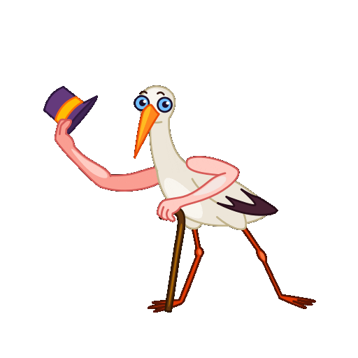
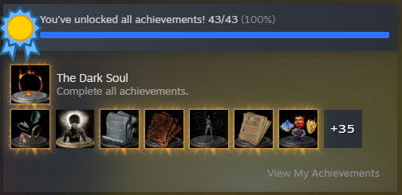

# Hi there! I'm Federico - aka <b>Lepre</b> 🐇

Here you can  <b><i>git</i></b> to know me better by peeking my public repositories, or using the links provided below.

 
 

I'm an Italian Front-end Engineer with an <i>MSc</i> and <i>BSc</i> in <i>Computer Engineering</i>, and just like any other nerd, I am passionate about <i>Artificial Intelligence</i>, <i>New technologies</i>, <i>Cryptocurrencies</i> and <i>From software games</i>

 
 

 

## GitHub Statistics 📊

 

<a href="https://federicolorrai.it" target="_blank" class="stroked-button">Visit my Portfolio</a>

    
    

    <a href="https://www.flaticon.com/free-icons/email" title="email icons">Contact icons created by Fathema Khanom - Flaticon</a>

